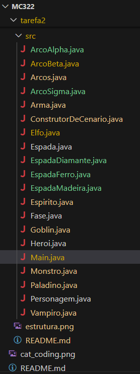

# RPG - Jogo Narrativo

Este projeto é a implementação de um Jogo Narrativo de RPG desenvolvido em Java, parte da disciplina MC322 - Programação Orientada a Objetos da Universidade Estadual de Campinas (Unicamp). O jogo simula um ambiente de aventura onde um herói enfrenta múltiplos desafios em fases distintas, com progressão de nível, combate dinâmico e sistema de itens.

## Descrição Geral

O projeto foca na aplicação de conceitos fundamentais de Programação Orientada a Objetos, como herança, polimorfismo, classes abstratas e encapsulamento. A história do jogo se desenrola à medida que o herói avança por diferentes fases, cada uma com sua ambientação e monstros específicos, cuja dificuldade aumenta progressivamente. O sistema inclui ganho de experiência, evolução de atributos do herói, e a utilização de armas com diferentes propriedades.

## Funcionalidades Principais

*   **Mundo Virtual com Fases**: O jogo é dividido em fases com dificuldade crescente, cada uma com um conjunto de monstros adaptados ao seu nível.
*   **Progressão de Nível do Herói**:
    *   Ganho de experiência (XP) ao derrotar monstros ou sobreviver a turnos de combate.
    *   Subida de nível com aumento de atributos (Pontos de Vida, Força, Agilidade) e ajuste da "Sorte".
    *   Armas específicas para cada tipo de herói, que se aprimoram com o nível.
*   **Sistema de Combate Dinâmico**:
    *   Combates baseados em turnos, com rolagens de dados (1d20) para determinar acertos.
    *   Acertos críticos com ativação de habilidades especiais.
    *   Diferentes tipos de ataque e habilidades para heróis e monstros.
*   **Tipos de Personagens**:
    *   **Heróis**: Atualmente implementado o **Elfo** (especializado em arcos e cura). A estrutura permite a fácil adição de outros heróis como o Paladino.
    *   **Monstros**: Inclui **Goblins** (com ataques de roubo), **Vampiros** (com ataques baseados em "brilho") e **Espíritos** (com ataques baseados em "tristeza").
*   **Sistema de Armas e Itens**:
    *   Classes de `Arma` abstratas e concretas para representar diferentes equipamentos.
    *   Heróis podem equipar armas que influenciam seu dano.
    *   Monstros têm uma chance de "dropar" armas ao serem derrotados.
    *   O herói pode decidir se deseja equipar uma arma dropada, considerando seu dano e nível.
*   **Mecanismo de Sorte**: Um atributo `sorte` (valor entre 0.0 e 1.0) influencia a chance de acertos críticos e a probabilidade de monstros largarem itens.

## Estrutura do Projeto

O projeto está organizado na seguinte estrutura de diretórios e classes, refletindo a abordagem orientada a objetos:
<p align="center">
  
</p>

## Como Executar o Projeto

### Pré-requisitos

*   [Java Development Kit (JDK) 21](https://www.oracle.com/java/technologies/downloads/) ou superior.

### Passos para Compilação e Execução

1.  **Clone o Repositório**:</br>
    Clone o repositório e entre no diretório raiz:
    ```bash
    git clone https://github.com/paulosnf12/MC322.git
    cd MC322
    ```

2.  **Compile o Código**:
    Dentro do diretório raiz do projeto (MC322) no terminal, compile:
    ```bash
    cd tarefa2
    javac -d bin $(find src -name "*.java")
    ```

3.  **Execute o Jogo**:
    Logo após a compilação com o comando javac -d bin $(find src -name "*.java"), basta executar o jogo digitando o comando a seguir:
    ```bash
    java -cp bin Main
    ```

    O jogo será executado diretamente no terminal, exibindo o log da simulação de combate e a progressão do herói.
    

## Estrutura das Classes

*   `Personagem` (Classe Abstrata): Base para heróis e monstros, define atributos e métodos básicos.
*   `Heroi` (Classe Abstrata): Estende `Personagem`, base para heróis jogáveis, com lógica de XP e níveis.
*   `Monstro` (Classe Abstrata): Estende `Personagem`, base para inimigos, com XP concedida e itens dropáveis.
*   `Elfo`, `Paladino` (Classes Concretas): Estendem `Heroi`, implementam ataques e habilidades especiais.
*   `Goblin`, `Vampiro`, `Espirito` (Classes Concretas): Estendem `Monstro`, implementam ataques e comportamentos únicos.
*   `Arma` (Classe Concreta): Representa um item de arma equipável, com dano e nível mínimo.
*   `Arcos`, `Espada` (Classes de Configuração): Usadas por Elfo e Paladino para definir os danos de seus tipos de arma conforme o nível.
*   `Fase`: Representa uma fase do jogo, com ambiente e lista de monstros.
*   `ConstrutorDeCenario`: Classe utilitária estática para gerar as fases do jogo.
*   `Main`: Ponto de entrada do jogo, orquestra a simulação das fases e combates.

## Balanceamento e Dificuldade

O jogo foi ajustado iterativamente para encontrar um equilíbrio entre desafio e jogabilidade. O balanceamento de atributos de heróis e monstros, bem como a taxa de ganho de experiência, foi refinado para garantir que a vitória seja uma conquista significativa para o jogador.

## Créditos

Este projeto foi desenvolvido como parte de um trabalho acadêmico.

*   **Desenvolvedores do Projeto**:
    *   Bárbara Maria Barreto Fonseca de Cerqueira César
    *   Paulo Santos do Nascimento Filho


