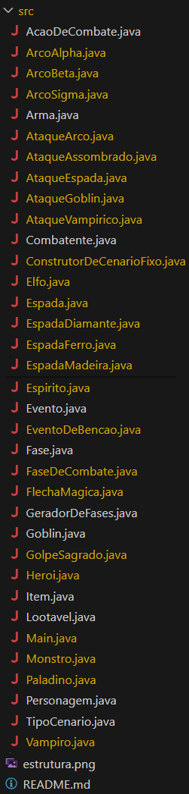

# RPG Narrativo - Tarefa 3

Este projeto é a implementação de um Jogo Narrativo de RPG desenvolvido em Java, como parte da disciplina MC322 - Programação Orientada a Objetos da Universidade Estadual de Campinas (Unicamp). O jogo simula um ambiente de aventura onde um herói enfrenta múltiplos desafios em fases distintas, com progressão de nível, combate dinâmico e um sistema robusto de itens e habilidades.

## Descrição Geral

O projeto foca na aplicação avançada de conceitos de Programação Orientada a Objetos. A principal evolução desta versão foi a **refatoração completa do código para uma arquitetura orientada a interfaces**, criando um sistema flexível, desacoplado e de fácil manutenção. A história se desenrola à medida que o herói avança por fases com monstros e eventos específicos, cuja dificuldade aumenta progressivamente.

## Destaque Principal: Arquitetura Orientada a Interfaces

A mudança mais significativa foi a transição de uma lógica fortemente acoplada para um design baseado em contratos (interfaces). O motor do jogo (classe `Main`) agora interage com abstrações como `Fase`, `Combatente` e `AcaoDeCombate`, sem precisar conhecer os detalhes concretos de cada herói ou ataque.

As principais interfaces que governam o sistema são:
*   **`Fase`**: Define o contrato para qualquer área ou nível do jogo.
*   **`Combatente`**: Representa qualquer entidade que participa de uma batalha (Heróis e Monstros).
*   **`AcaoDeCombate`**: Descreve qualquer ação executável em combate (ataques, habilidades).
*   **`Lootavel`**: Define uma entidade que pode dropar uma recompensa ao ser derrotada.
*   **`Evento`**: Modela eventos especiais que podem ser disparados dentro de uma fase.
*   **`Item`**: Interface base para qualquer item do jogo.

## Funcionalidades Principais

*   **Mundo Virtual com Fases**: O jogo é dividido em fases com dificuldade crescente, cada uma com um conjunto de monstros e eventos adaptados ao seu nível.
*   **Sistema de Combate Dinâmico**:
    *   Combates por turnos, com rolagens de dados (1d20) para determinar acertos.
    *   **Ataque Crítico com Habilidade Garantida**: Uma rolagem de 20 não é apenas um dano extra, mas ativa a habilidade especial do herói (`FlechaMagica` ou `GolpeSagrado`).
    *   Ações modulares (`AcaoDeCombate`) que permitem fácil adição de novas habilidades.
*   **Progressão de Nível e Equipamentos**:
    *   Ganho de experiência (XP) ao derrotar monstros.
    *   Subida de nível com aumento de atributos (Vida, Força, Agilidade).
    *   **Lógica de Upgrade Inteligente**: Ao subir de nível, o herói não substitui uma arma forte (dropada) por uma padrão mais fraca. O sistema sempre mantém o melhor equipamento.
*   **Sistema de Eventos**:
    *   Eventos são disparados com base em gatilhos específicos. Atualmente, ao entrar na fase da Floresta, o herói recebe uma bênção que restaura sua vida.
*   **Heróis Jogáveis com Classes Distintas**:
    *   **Elfo**: Ágil, especialista em arcos, com cura passiva em seus ataques.
    *   **Paladino**: Resistente, mestre de espadas, com um poderoso golpe sagrado. Agora está totalmente jogável (requer descomentar na classe `Main`).
*   **Mecanismo de Sorte**: Um atributo `sorte` (0.0 a 1.0) influencia habilidades e a chance de drops. Por exemplo, o `GolpeSagrado` do Paladino recebe 20% de dano bônus se a sorte for maior que 0.4.

## Melhorias e Correções (Fixes)

*   **Sistema de Experiência**: A XP agora é concedida corretamente **apenas ao derrotar um monstro**, e não mais ao final de cada turno.
*   **Restrição de Equipamentos**: Heróis só podem equipar armas compatíveis com sua classe (Elfos usam Arcos, Paladinos usam Espadas).
*   **Balanceamento de Atributos**: A vida ganha ao subir de nível foi ajustada para uma progressão mais suave.
*   **Diálogos Dinâmicos**: As falas dos heróis em encontros especiais foram adaptadas para serem genéricas, funcionando de forma coerente com qualquer personagem.

## Personagens, Armas e Balanceamento

### O Paladino
*   **Ações de Combate**: `AqueEspada` (básico), `GolpeSagrado` (especial).
*   **Armas Equipáveis**: Espadas (`Espada de Madeira`, `Espada de Ferro`, `Espada de Diamante`).
*   **Danos Base Recomendados**: 6 (Madeira), 17 (Ferro), 37 (Diamante).

### O Elfo
*   **Ações de Combate**: `AtaqueArco` (básico), `FlechaMagica` (especial).
*   **Armas Equipáveis**: Arcos (`Arco Beta`, `Arco Alpha`, `Arco Sigma`).
*   **Danos Base Recomendados**: 8 (Beta), 17 (Alpha), 32 (Sigma).

### Itens Dropáveis dos Monstros
*   `Espada de Madeira [encantada]`
*   `Arco Beta [encantado]`
*   `Espada de Ferro [encantada]`
*   `Arco Alpha [encantado]`
*   `Espada de Diamante [Lendária]`
*   `Arco Sigma [Lendário]`

## Estrutura do Projeto

A estrutura de arquivos foi organizada para refletir a separação de responsabilidades e a arquitetura orientada a objetos.

<p align="center">
  
</p>

## Como Executar o Projeto

### Pré-requisitos

*   [Java Development Kit (JDK) 21](https://www.oracle.com/java/technologies/downloads/) ou superior.

### Passos para Compilação e Execução

1.  **Clone o Repositório**:
    Clone o repositório e navegue até o diretório da tarefa.
    ```bash
    git clone https://github.com/paulosnf12/MC322.git
    cd MC322
    ```

2.  **Compile o Código**:
    Dentro do diretório raiz do projeto (MC322) no terminal, compile:
    ```bash
    cd tarefa2
    javac -d bin $(find src -name "*.java")
    ```

3.  **Execute o Jogo**:
    Logo após a compilação com o comando javac -d bin $(find src -name "*.java"), basta executar o jogo digitando o comando a seguir:
    ```bash
    java -cp bin Main
    ```

    O jogo será executado diretamente no terminal, exibindo o log da simulação de combate e a progressão do herói.

## Estrutura das Classes

O projeto é dividido em uma arquitetura modular, com uma clara separação entre interfaces (contratos), classes abstratas (esqueletos) e classes concretas (implementações).

### Interfaces (Contratos)
*   **`Combatente`**: Define o comportamento essencial de qualquer entidade que pode participar de uma batalha.
*   **`AcaoDeCombate`**: Representa qualquer ação executável em combate, como um ataque ou uma habilidade.
*   **`Item`**: Interface base para qualquer item do jogo (armas, poções, etc.).
*   **`Lootavel`**: Define uma entidade que pode dropar uma recompensa ao ser derrotada.
*   **`Fase`**: Descreve o contrato para qualquer área ou nível do jogo.
*   **`GeradorDeFases`**: Define um objeto capaz de criar uma sequência de fases.
*   **`Evento`**: Modela um evento especial que pode ser disparado dentro de uma fase.

### Estrutura de Personagens (Classes Abstratas)
*   **`Personagem`**: Classe base para todos os seres vivos, implementa `Combatente` e define atributos essenciais como nome, vida, força e agilidade.
*   **`Heroi`**: Herda de `Personagem`. Base para todos os heróis jogáveis, implementa a lógica de XP, níveis e a escolha de ações baseada em inputs do jogo.
*   **`Monstro`**: Herda de `Personagem`. Base para os inimigos, implementa `Lootavel` e a lógica de IA para `escolherAcao`.

### Heróis e Monstros (Classes Concretas)
*   **`Elfo`, `Paladino`**: Herdam de `Heroi`, cada um com sua lista de ações e mecânicas únicas.
*   **`Goblin`, `Vampiro`, `Espirito`**: Herdam de `Monstro`, com comportamentos, diálogos e ataques específicos.

### Ações e Habilidades (Classes Concretas)
*   **`AtaqueArco`, `AtaqueEspada`**: Implementam `AcaoDeCombate` como os ataques básicos dos heróis.
*   **`FlechaMagica`, `GolpeSagrado`**: Habilidades especiais dos heróis.
*   **`AtaqueAssombrado`, `AtaqueGoblin`, `AtaqueVampirico`**: Habilidades únicas dos monstros.

### Itens e Armas
*   **`Arma` (Abstrata)**: Implementa `Item`. Classe base para todos os equipamentos, definindo dano, nível mínimo e tipo.
*   **`ArcoAlpha`, `ArcoBeta`, `ArcoSigma`**: Classes concretas que herdam de `Arma`, representando os arcos do jogo.
*   **`EspadaMadeira`, `EspadaFerro`, `EspadaDiamante`**: Classes concretas que herdam de `Arma`, representando as espadas do jogo.

### Mundo e Lógica de Jogo
*   **`FaseDeCombate` (Concreta)**: Implementa a interface `Fase` e representa um nível do jogo, contendo monstros e eventos.
*   **`ConstrutorDeCenarioFixo`**: Implementa `GeradorDeFases`. Classe responsável por criar e configurar todas as fases da campanha.
*   **`EventoDeBencao`**: Implementação concreta de `Evento`, que cura o herói na floresta.
*   **`TipoCenario` (Enum)**: Define os diferentes ambientes do jogo e seus efeitos.

### Classe Principal
*   **`Main`**: Ponto de entrada do projeto. Orquestra a criação do cenário, o loop principal de fases e os combates, interagindo apenas com as interfaces para garantir o baixo acoplamento.

## Planos Futuros

*   **Nova Mecânica para o Paladino**: Implementar um efeito de **sangramento** no `GolpeSagrado`, causando dano contínuo ao monstro.
*   **Sistema de Tipos de Dano**: Diferenciar danos em **Físico** e **Mágico** para introduzir mecânicas de resistência e fraqueza.

## Créditos

Este projeto foi desenvolvido como parte de um trabalho acadêmico.

*   **Desenvolvedores do Projeto**:
    *   Bárbara Maria Barreto Fonseca de Cerqueira César
    *   Paulo Santos do Nascimento Filho