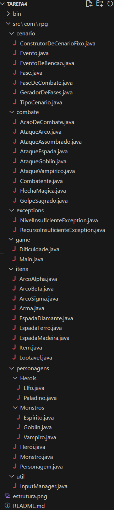

# RPG Narrativo - Tarefa 4

Este projeto é a implementação de um Jogo Narrativo de RPG desenvolvido em Java, como parte da disciplina MC322 - Programação Orientada a Objetos da Universidade Estadual de Campinas (Unicamp). O jogo agora é uma experiência totalmente interativa, onde o jogador controla o fluxo da aventura, escolhe a dificuldade e gerencia a campanha do herói através de menus.

## Descrição Geral

A Tarefa 4 transforma a simulação da versão anterior em um jogo completo e robusto. Com base na arquitetura orientada a interfaces da Tarefa 3, esta versão introduz interatividade com o jogador, um sistema de dificuldade, uma arquitetura de pacotes organizada e tratamento de exceções. O resultado é um jogo mais resiliente, dinâmico e com maior manutenibilidade.

## Destaque Principal: De Simulação a Jogo Interativo

A mudança mais significativa foi a transição de uma simulação automática para um jogo controlado pelo jogador. Agora, o fluxo do programa depende das escolhas do usuário, que são capturadas e validadas pelo sistema, garantindo que o jogo não quebre por entradas inválidas.

As principais evoluções que permitiram essa transformação são:
*   **Menus de Interação**: Implementação de um Menu Principal para iniciar ou sair do jogo e um Menu Pós-Combate para gerenciar o personagem após cada batalha.
*   **Gerenciador de Entradas (`InputManager`)**: Uma classe utilitária centralizada que gerencia toda a interação com o console, validando entradas e tratando erros de forma segura.
*   **Sistema de Dificuldade**: O jogador pode escolher entre os níveis `FACIL`, `NORMAL` e `DIFICIL`, alterando dinamicamente o poder dos monstros e a chance de obter melhores recompensas.
*   **Tratamento de Exceções Customizadas**: O jogo agora lança e trata exceções específicas do jogo, como `NivelInsuficienteException`, tornando o controle de fluxo mais claro e objetivo.

## Novas Funcionalidades e Melhorias

*   **Arquitetura de Pacotes**: O projeto foi completamente refatorado para uma estrutura de pacotes lógica (`com.rpg.game`, `com.rpg.personagens`, `com.rpg.itens`, etc.), melhorando a organização e a manutenibilidade do código.
*   **Gerenciador de Entradas (`InputManager`)**: Classe estática responsável por toda a leitura de dados do console. Garante que o programa só receba entradas válidas (inteiros em um intervalo, strings, etc.), tratando exceções como `InputMismatchException` internamente.
*   **Sistema de Dificuldade Dinâmica**:
    *   Ao iniciar um novo jogo, o jogador escolhe a dificuldade.
    *   Essa escolha ajusta dinamicamente os atributos dos monstros (vida, força e XP concedido). Em dificuldades maiores, a chance de obter armas melhores (o *loot*) também é ajustada.
*   **Exceções Customizadas**:
    *   Foram criadas exceções como `NivelInsuficienteException` para representar erros específicos do jogo.
    *   Por exemplo, ao tentar equipar uma arma de nível superior, o jogo agora lança essa exceção, que é tratada na `Main`, informando o jogador do erro de forma elegante em vez de apenas impedir a ação.
*   **Menus e Fluxo de Jogo**:
    *   **Menu Principal**: Permite iniciar um novo jogo, ver informações sobre heróis/monstros ou sair.
    *   **Menu Pós-Combate**: Após cada vitória, o jogador pode interagir com o loot, ver o status do personagem, desistir do jogo ou continuar a aventura.

## Estrutura do Projeto

O código-fonte foi reorganizado em pacotes, seguindo as convenções do Java para agrupar classes com responsabilidades relacionadas. A nova estrutura de diretórios `src` é a seguinte:

<p align="center">
  
</p>

## Como Executar o Projeto

### Pré-requisitos

*   [Java Development Kit (JDK) 21](https://www.oracle.com/java/technologies/downloads/) ou superior.

### Passos para Compilação e Execução

1.  **Clone o Repositório**:
    Clone o repositório e navegue até o diretório da `tarefa4`.
    ```bash
    git clone https://github.com/paulosnf12/MC322.git
    cd MC322
    ```

2.  **Compile o Código**:
    Dentro do diretório raiz do projeto (MC322) no terminal, execute os comandos a seguir. Ele compilará todos os arquivos `.java` da pasta `src` e colocará os `.class` na pasta `bin`, mantendo a estrutura de pacotes.
    ```bash
    # Para Linux/macOS
    cd tarefa4
    javac -d bin -sourcepath src $(find src -name "*.java")
    ```
    *Observação: Para Windows, pode ser necessário um comando equivalente para listar todos os arquivos fonte.*

3.  **Execute o Jogo**:
    Após compilar, execute o jogo com o seguinte comando, que especifica o `classpath` e o nome completo da classe principal.
    ```bash
    java -cp bin com.rpg.game.Main
    ```
    O menu do jogo será exibido no terminal, e você poderá interagir com ele.

## Requisitos para Implementação da Tarefa 4

Para a implementação desta tarefa, foram cumpridos os seguintes requisitos conforme o enunciado:

- ** Arquitetura de Pacotes:** O projeto foi inteiramente refatorado, com todas as classes organizadas em pacotes lógicos como `com.rpg.game`, `com.rpg.personagens`, e `com.rpg.itens`, conforme especificado.

- ** Gerenciador de Entradas (`InputManager`):** A classe `InputManager` foi implementada no pacote `com.rpg.util` com todos os métodos estáticos solicitados (`lerInteiro`, `lerString`, `lerSimNao`, `esperarEnter`, `fecharScanner`), garantindo a robustez das interações.

- ** Sistema de Dificuldade:** Foi criado o `enum Dificuldade` com os níveis `FACIL`, `NORMAL` e `DIFICIL`, e a classe `ConstrutorDeCenarioFixo` utiliza o parâmetro de dificuldade para ajustar os atributos dos monstros.

- ** Interação com o Jogador:** A classe `Main` foi reestruturada para apresentar um menu principal e um menu pós-combate, utilizando o `InputManager` para todas as interações e controlando o fluxo do jogo com base nas escolhas do usuário.

- ** Tratamento de Exceções Customizadas:** Foram criadas as classes `NivelInsuficienteException` e `RecursoInsuficienteException`. A `NivelInsuficienteException` é lançada pelo método `equiparArma` na classe `Heroi` e tratada com um bloco `try-catch` na `Main`, demonstrando um controle de fluxo de erros robusto.

- ** Adaptação da Classe `Main`:** O fluxo principal do jogo foi completamente adaptado para iniciar com o menu, solicitar a dificuldade, gerar as fases de acordo e exibir o menu pós-combate, satisfazendo todos os requisitos de reestruturação.

## Créditos

Este projeto foi desenvolvido como parte de um trabalho acadêmico.

*   **Desenvolvedores do Projeto**:
    *   Bárbara Maria Barreto Fonseca de Cerqueira César

    *   Paulo Santos do Nascimento Filho

