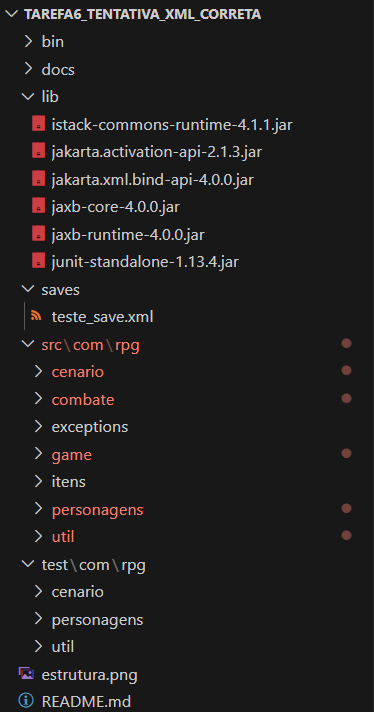

# RPG Narrativo - Tarefa 5

Este projeto é a implementação de um Jogo Narrativo de RPG desenvolvido em Java, como parte da disciplina MC322 - Programação Orientada a Objetos da Universidade Estadual de Campinas (Unicamp). Esta quinta tarefa foca em garantir a robustez e a qualidade do código através da implementação de testes unitários com JUnit e da documentação completa com Javadoc.

## Descrição Geral

A Tarefa 5 eleva a qualidade do jogo interativo desenvolvido na tarefa anterior, introduzindo duas práticas essenciais no desenvolvimento de software: testes automatizados e documentação formal. O objetivo não é adicionar novas funcionalidades ao jogo, mas sim garantir que as funcionalidades existentes operem como esperado e sejam fáceis de entender e manter.

Para isso, foi utilizada a biblioteca **JUnit 5** para a criação de um conjunto de testes unitários que validam desde a lógica de combate até o sistema de dificuldade, e a ferramenta **Javadoc** para gerar uma documentação HTML completa a partir de comentários no código-fonte.

## Destaque Principal: Robustez e Documentação

O foco desta tarefa foi solidificar a base do projeto, garantindo que ele seja confiável e de fácil manutenção.

*   **Testes Unitários com JUnit**: Foi criada uma suíte de testes para validar os principais componentes do jogo de forma isolada. Isso garante que mudanças futuras não quebrem funcionalidades existentes e que a lógica de negócio (regras do jogo) está correta.
*   **Documentação Profissional com Javadoc**: O código foi enriquecido com comentários Javadoc nos métodos e classes mais importantes, conforme as diretrizes da tarefa. Esses comentários foram usados para gerar uma documentação HTML navegável, tornando o projeto compreensível para outros desenvolvedores.

## Estrutura do Projeto

A estrutura do projeto foi expandida para acomodar os testes, a documentação e as bibliotecas externas, seguindo as melhores práticas de organização:

<p align="center">
  
</p>

*   **`lib/`**: Nova pasta que contém bibliotecas externas (`.jar`). Atualmente, abriga o **JUnit 5 Standalone**, necessário para compilar e executar os testes.
*   **`test/`**: Nova pasta que contém todo o código de teste. Sua estrutura de pacotes espelha a da pasta `src`, uma convenção que facilita a localização dos testes correspondentes a cada classe do jogo.
*   **`docs/`**: Pasta que contém a documentação HTML gerada pelo Javadoc. Ela é o resultado da compilação dos comentários Javadoc do seu código-fonte.

## Como Compilar e Executar

### Pré-requisitos

*   [Java Development Kit (JDK) 21](https://www.oracle.com/java/technologies/downloads/) ou superior.
*   Um ambiente de terminal que suporte o comando `find` (como Git Bash no Windows, ou qualquer terminal Linux/macOS).

### Passos para Compilação e Execução

1.  **Clone o Repositório**:
    Clone o repositório e navegue até o diretório da `tarefa5`.
    ```bash
    git clone https://github.com/paulosnf12/MC322.git
    cd MC322/tarefa5
    ```

2.  **Para Compilar o Projeto (Código-fonte + Testes)**:
    Execute o comando abaixo. Ele compilará todo o código das pastas `src` e `test`, utilizando a biblioteca JUnit do `classpath` e salvando os arquivos `.class` na pasta `bin`.
    ```bash
    javac -d bin -sourcepath src -classpath lib/junit-standalone-1.13.4.jar $(find src -name "*.java") $(find test -name "*.java")
    ```

3.  **Para Executar os Testes Unitários**:
    Este comando utiliza o executor do JUnit para escanear a pasta `bin` em busca de classes de teste e executá-las. O resultado (sucesso ou falha) será exibido no console.
    ```bash
    java -jar lib/junit-standalone-1.13.4.jar --class-path bin --scan-classpath
    ```

4.  **Para Executar o Jogo Principal**:
    Para jogar, use o comando a seguir, que executa a classe `Main` a partir dos arquivos compilados na pasta `bin`.
    ```bash
    java -cp bin com.rpg.game.Main
    ```

5.  **Para Gerar a Documentação Javadoc**:
    Este comando lê os comentários Javadoc no seu código-fonte (`src`) e gera um site HTML na pasta `docs`.
    ```bash
    javadoc -d docs -sourcepath src -subpackages com.rpg
    ```

## Acessando a Documentação

A documentação completa do projeto, gerada pelo Javadoc, está localizada na pasta `docs/`. Para visualizá-la, abra o arquivo **`docs/index.html`** no seu navegador de preferência.

## Testes Implementados e Validação dos Requisitos

Foram criados testes unitários para validar todas as funcionalidades exigidas na tarefa.

-   **Gerenciador de Entradas (`InputManagerTest.java`)**
    *   **Objetivo**: Garantir que os métodos de leitura de entrada do usuário funcionem corretamente, tanto para casos válidos quanto para inválidos.
    *   **Testes**: Foram testados os métodos `lerString` e `lerSimNao`, cobrindo entradas corretas, entradas vazias/inválidas (que devem solicitar novamente) e o caso de ausência de entrada, que corretamente lança uma `RuntimeException`.

-   **Sistema de Dificuldade (`ConstrutorDeCenarioFixoTest.java`)**
    *   **Objetivo**: Validar que a escolha de dificuldade afeta os atributos dos monstros.
    *   **Testes**: Um teste foi implementado para gerar monstros nas dificuldades `FACIL` e `DIFICIL` e comparar seus atributos. O teste confirma que monstros em `DIFICIL` têm mais vida e força, e concedem menos XP, como esperado.

-   **Combatentes (`PaladinoTest.java`, `GoblinTest.java`)**
    *   **Objetivo**: Testar as mecânicas fundamentais de combate e as interfaces.
    *   **Testes**: Para validar a implementação de interfaces como a `Combatente`, foi adotada a estratégia de testar uma classe concreta de cada hierarquia (`Paladino` para Heróis, `Goblin` para Monstros). Devido ao princípio da herança, se uma classe base implementa uma interface, o compilador garante que todas as suas subclasses também a implementem. Além disso, foram criados testes específicos para validar o recebimento de dano, o ataque a um monstro e o ganho de experiência com subida de nível.

-   **Exceções (`HeroiExceptionTest.java`)**
    *   **Objetivo**: Garantir que as exceções customizadas do jogo sejam lançadas corretamente.
    *   **Testes**: Foram implementados dois testes de exceção principais:
        *   **`NivelInsuficienteException`**: Simula um herói de nível baixo tentando equipar uma arma de nível alto, confirmando que a exceção correta é lançada.
        *   **`RecursoInsuficienteException`**: Simula um herói com mana insuficiente tentando usar uma habilidade especial. O teste valida que a exceção é lançada, impedindo a ação.

## Créditos

Este projeto foi desenvolvido como parte de um trabalho acadêmico.

*   **Desenvolvedores do Projeto**:
    *   Bárbara Maria Barreto Fonseca de Cerqueira César
    *   Paulo Santos do Nascimento Filho